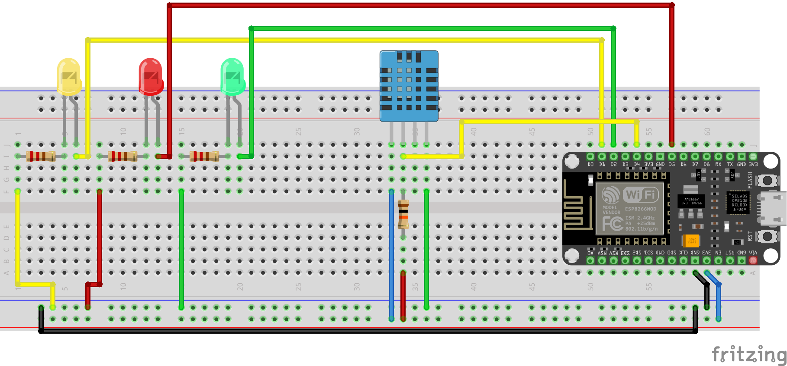
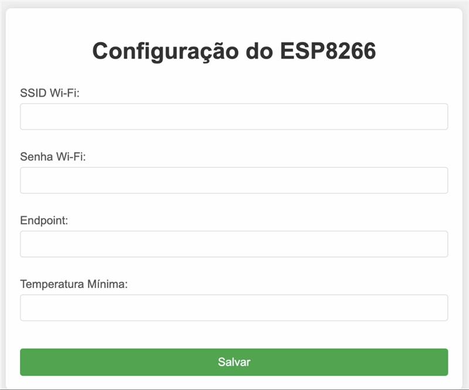

# IoT Temperature Monitoring System with ESP8266

This project implements a temperature monitoring system using the ESP8266 microcontroller, a DHT11 temperature sensor, and a simple web-based configuration interface. The system monitors the temperature and sends data to a specified server endpoint when certain conditions are met.

## Features
- **Temperature Monitoring**: Measures the ambient temperature using the DHT11 sensor.
- **LED Indicators**:
  - **Yellow**: Device not configured or Wi-Fi connection issue.
  - **Green**: Temperature within the specified range.
  - **Red**: Temperature below the configured minimum.
- **Web Configuration Interface**:
  - Configure Wi-Fi credentials.
  - Set the server endpoint for data logging.
  - Specify the minimum temperature threshold.
- **EEPROM Storage**: Saves configuration settings persistently.
- **HTTPS Requests**: Sends temperature data to a remote server via HTTPS.
- **Reset Functionality**: Physical button to reset and clear all saved configurations.

## Components
- **Microcontroller**: NodeMCU ESP8266
- **Temperature Sensor**: DHT11
- **LED Indicators**:
  - Yellow: Status LED
  - Green: Normal operation
  - Red: Alert (Temperature below threshold)
- **Push Button**: Resets the configuration.
- **Power Supply**: 5V via USB or external source.

## Wiring Diagram
Below is the Fritzing diagram of the circuit setup:



## How It Works
1. **Startup**:
   - The device attempts to load Wi-Fi credentials and configuration from EEPROM.
   - If credentials are missing or invalid, it starts a Wi-Fi Access Point (AP) for configuration.
2. **Configuration**:
   - Connect to the AP named `ESP8266_Config`.
   - Access the web interface at `http://192.168.4.1`.
   - Enter Wi-Fi credentials, server endpoint, and the minimum temperature threshold.
   - Save the configuration and restart the device.
3. **Operation**:
   - Once connected to Wi-Fi, the device reads temperature data every 10 seconds.
   - If the temperature is below the threshold, it:
     - Lights up the red LED.
     - Sends the temperature data to the configured server endpoint.
   - If the temperature is within range, it lights up the green LED.

## Web Configuration Interface
The system includes a web interface for user-friendly configuration of Wi-Fi credentials and other settings.



## Setup Instructions
1. **Clone this Repository**:
   ```bash
   git clone https://github.com/Viniciuscs01/nodemcu-tempserver.git
   cd nodemcu-tempserver
2. Install Required Libraries:
- Install the following libraries in the Arduino IDE:
  - ESP8266WiFi
  - ESP8266WebServer
  - DHT
  - EEPROM
  - ESP8266HTTPClient

3. Flash the Code:
- Open the .ino file in Arduino IDE.
- Select the correct board and port.
- Upload the code to the ESP8266.

4. Assemble the Circuit:
 - Refer to the wiring diagram for proper connections.

## Usage
1. Power on the device.
2. If the device is not configured, connect to the ESP8266_Config AP.
3. Open the configuration page and input your settings.
4. Save the settings and restart the device.
5. Observe the LEDs for status feedback:
6. Yellow: Device not configured or failed to connect to Wi-Fi.
7. Green: Normal operation.
8. Red: Alert (temperature below the threshold).

## Future Enhancements
1. Add support for additional sensors.
2. Implement over-the-air (OTA) updates.
3. Add support for SSL/TLS validation for server endpoints.

## License
This project is open-source and available under the MIT License.

## Acknowledgments
This project was developed as a part of a college assignment.
Special thanks to the Arduino community for providing extensive documentation and support.
